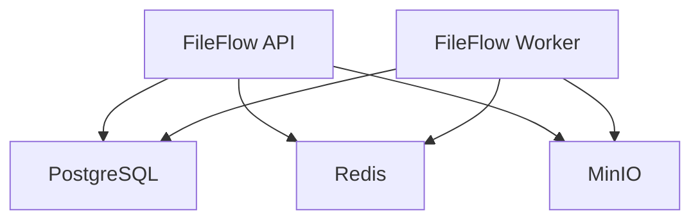

# FileFlow Deployment Guide

Complete setup instructions for the FileFlow Intelligent File Processing Pipeline.

## System Requirements

### Production Environment
- **Docker** 20.10+ with Docker Compose V2
- **Memory**: 4GB RAM minimum, 8GB recommended
- **Storage**: 20GB available disk space
- **Network**: Internet access for Docker image downloads

### Development Environment (Optional)
- **Node.js** 18.0+ with npm 8.0+
- **TypeScript** 4.9+ (installed automatically)
- **Git** 2.30+ for version control

## Production Deployment

### 1. Environment Preparation

```bash
# Clone the repository
git clone https://github.com/KabsiMontassar/IFPP-Intelligent-File-Processing-Pipeline.git
cd IFPP-Intelligent-File-Processing-Pipeline

# Create environment configuration
cp .env.example .env
```

### 2. Configuration Review

Edit `.env` file for production settings:

```bash
# Production configuration
NODE_ENV=production
PORT=3000

# Security: Change default passwords
DB_PASSWORD=your-secure-database-password
REDIS_PASSWORD=your-secure-redis-password
MINIO_ACCESS_KEY=your-minio-access-key
MINIO_SECRET_KEY=your-minio-secret-key

# JWT Security
JWT_SECRET=your-super-secure-jwt-secret-key

# File Processing Limits
MAX_FILE_SIZE=104857600  # 100MB
ALLOWED_FILE_TYPES=pdf,doc,docx,xls,xlsx,ppt,pptx,txt,csv,json,xml,jpg,jpeg,png,gif,bmp,tiff,mp4,avi,mov,wmv,flv,webm,mp3,wav,flac
```

### 3. Service Deployment

```bash
# Deploy all services
docker compose up -d

# Monitor deployment progress
docker compose logs -f

# Verify all services are healthy
docker compose ps
```

```bash
# Check system health
curl http://localhost:3000/health

# Test file upload capability
curl -X POST -F "files=@/path/to/test/file.pdf" \
  http://localhost:3000/api/v1/files/upload

# Verify file search functionality
curl "http://localhost:3000/api/v1/files/search?limit=10"
```

## Service Architecture

The system consists of the following components:

### Core Services

1. **FileFlow API** - Express.js REST API server
2. **FileFlow Worker** - Background job processor
3. **PostgreSQL** - Primary database for metadata and file records
4. **Redis** - Cache and job queue management
5. **MinIO** - S3-compatible object storage

### Service Dependencies



## Manual Service Setup (Development)

If you prefer to run services individually:

### Database Setup (PostgreSQL)

```bash
# Start PostgreSQL
docker run -d \
  --name fileflow-postgres \
  -e POSTGRES_USER=fileflow \
  -e POSTGRES_PASSWORD=fileflow_password \
  -e POSTGRES_DB=fileflow_db \
  -p 5432:5432 \
  postgres:15-alpine

# Run database migrations
npm run migrate
```

### Redis Setup

```bash
# Start Redis
docker run -d \
  --name fileflow-redis \
  -p 6379:6379 \
  redis:7-alpine redis-server --requirepass redis_password
```

### MinIO Setup

```bash
# Start MinIO
docker run -d \
  --name fileflow-minio \
  -p 9000:9000 \
  -p 9001:9001 \
  -e MINIO_ROOT_USER=fileflow_admin \
  -e MINIO_ROOT_PASSWORD=fileflow_admin_password \
  minio/minio server /data --console-address ":9001"

# Create buckets (run after MinIO starts)
docker exec fileflow-minio \
  mc alias set local http://localhost:9000 fileflow_admin fileflow_admin_password

docker exec fileflow-minio mc mb local/fileflow-uploads
docker exec fileflow-minio mc mb local/fileflow-processed
docker exec fileflow-minio mc mb local/fileflow-thumbnails
```

### Apache Tika Setup (Optional)

```bash
# Download and start Tika server
wget https://archive.apache.org/dist/tika/2.8.0/tika-server-standard-2.8.0.jar
java -jar tika-server-standard-2.8.0.jar --host=0.0.0.0 --port=9998
```

## Development Workflow

### Start Development Servers

```bash
# Terminal 1: Start API server
npm run dev

# Terminal 2: Start worker processes
npm run worker

# Terminal 3: Monitor logs
docker-compose logs -f
```

### Running Tests

```bash
# Run all tests
npm test

# Run with coverage
npm run test:coverage

# Run specific test file
npm test -- --grep "FileModel"
```

### Code Quality

```bash
# Lint code
npm run lint

# Fix linting issues
npm run lint:fix

# Format code
npm run format
```

## Production Deployment

### Environment Configuration

Create production environment file:

```bash
cp .env.example .env.production
```

Update critical settings:
```bash
NODE_ENV=production
JWT_SECRET=your-super-secure-random-secret-key
DB_PASSWORD=secure-database-password
REDIS_PASSWORD=secure-redis-password
MINIO_SECRET_KEY=secure-minio-secret-key
```

### Docker Production Build

```bash
# Build production images
docker-compose -f docker-compose.yml -f docker-compose.prod.yml build

# Start production services
docker-compose -f docker-compose.yml -f docker-compose.prod.yml up -d

# Monitor startup
docker-compose -f docker-compose.yml -f docker-compose.prod.yml logs -f
```

### SSL/TLS Setup

For production, set up reverse proxy with SSL:

```nginx
# nginx.conf
server {
    listen 443 ssl;
    server_name your-domain.com;
    
    ssl_certificate /path/to/cert.pem;
    ssl_certificate_key /path/to/key.pem;
    
    location / {
        proxy_pass http://localhost:3000;
        proxy_set_header Host $host;
        proxy_set_header X-Real-IP $remote_addr;
    }
}
```

## Service URLs

When all services are running:

- **API Server**: http://localhost:3000
- **MinIO Console**: http://localhost:9001 (admin/password)
- **PostgreSQL**: localhost:5432
- **Redis**: localhost:6379
- **Apache Tika**: http://localhost:9998 (if installed)

## Common Commands

```bash
# View service logs
docker-compose logs [service_name]

# Restart specific service
docker-compose restart fileflow-api

# Stop all services
docker-compose down

# Clean up (removes volumes)
docker-compose down -v

# Check service health
curl http://localhost:3000/health

# Monitor queue status
curl http://localhost:3000/api/v1/admin/queues

# Database shell access
docker-compose exec postgres psql -U fileflow -d fileflow_db

# Redis CLI access
docker-compose exec redis redis-cli -a redis_password

# MinIO CLI access
docker-compose exec minio mc ls local/
```

## Backup & Recovery

### Database Backup

```bash
# Backup database
docker-compose exec postgres pg_dump -U fileflow fileflow_db > backup.sql

# Restore database
docker-compose exec -T postgres psql -U fileflow fileflow_db < backup.sql
```

### File Storage Backup

```bash
# Backup MinIO data
docker-compose exec minio mc mirror local/fileflow-uploads ./backup/uploads/
docker-compose exec minio mc mirror local/fileflow-processed ./backup/processed/
docker-compose exec minio mc mirror local/fileflow-thumbnails ./backup/thumbnails/
```

## Monitoring Setup

### Health Check Endpoints

- `/health` - Overall system status
- `/health/ready` - Kubernetes readiness probe
- `/health/live` - Kubernetes liveness probe

### Prometheus Metrics (Optional)

Add to docker-compose.yml:

```yaml
prometheus:
  image: prom/prometheus
  ports:
    - "9090:9090"
  volumes:
    - ./monitoring/prometheus.yml:/etc/prometheus/prometheus.yml

grafana:
  image: grafana/grafana
  ports:
    - "3001:3000"
  environment:
    - GF_SECURITY_ADMIN_PASSWORD=admin
```

## Performance Tuning

### Database Optimization

```sql
-- Create additional indexes for better performance
CREATE INDEX CONCURRENTLY idx_files_status_created ON files(status, created_at);
CREATE INDEX CONCURRENTLY idx_file_metadata_text_search ON file_metadata USING gin(to_tsvector('english', extracted_text));
```

### Redis Optimization

```bash
# Increase Redis memory limit
echo "maxmemory 1gb" >> redis.conf
echo "maxmemory-policy allkeys-lru" >> redis.conf
```

### Worker Scaling

```bash
# Scale worker processes
docker-compose up -d --scale fileflow-worker=3
```

## Troubleshooting

### Common Issues

1. **Port conflicts**: Change ports in docker-compose.yml
2. **Out of disk space**: Clean up with `docker system prune`
3. **Memory issues**: Increase Docker Desktop memory allocation
4. **Permission errors**: Check file permissions and Docker access

### Debug Mode

```bash
# Enable debug logging
export LOG_LEVEL=debug
export DEBUG=*

# Start with verbose output
docker-compose up --no-daemon
```

### Reset Everything

```bash
# Complete reset (WARNING: destroys all data)
docker-compose down -v
docker system prune -a
npm run migrate
```

## Maintenance

### Log Management

```bash
# View application logs
docker compose logs fileflow-api
docker compose logs fileflow-worker

# Monitor all services
docker compose logs -f

# Log rotation (production)
docker compose logs --tail=1000 > fileflow.log
```

### Performance Monitoring

```bash
# Check resource usage
docker stats

# Monitor disk usage
df -h

# Check database connections
docker compose exec postgres psql -U fileflow -d fileflow_db -c "SELECT COUNT(*) FROM pg_stat_activity;"
```

### Backup and Recovery

```bash
# Database backup
docker compose exec postgres pg_dump -U fileflow fileflow_db > backup.sql

# MinIO data backup
docker compose exec minio mc mirror /data /backup

# Environment backup
cp .env .env.backup
```

## Support and Troubleshooting

For production deployments and technical support:

1. **Check System Health**: `curl http://localhost:3000/health`
2. **Review Service Logs**: `docker compose logs -f`
3. **Verify Configuration**: Ensure all environment variables are properly set
4. **Database Connectivity**: Test PostgreSQL connection independently
5. **Network Issues**: Verify Docker network configuration
6. **Resource Constraints**: Monitor CPU and memory usage

### Community Support

- **GitHub Issues**: Report bugs and request features
- **Documentation**: Comprehensive API and deployment guides
- **Security**: Report vulnerabilities privately through GitHub Security tab